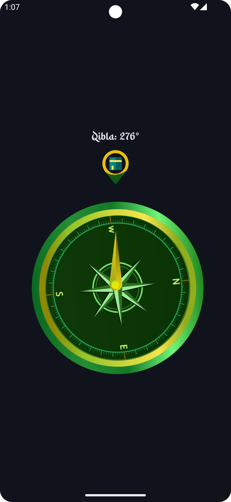
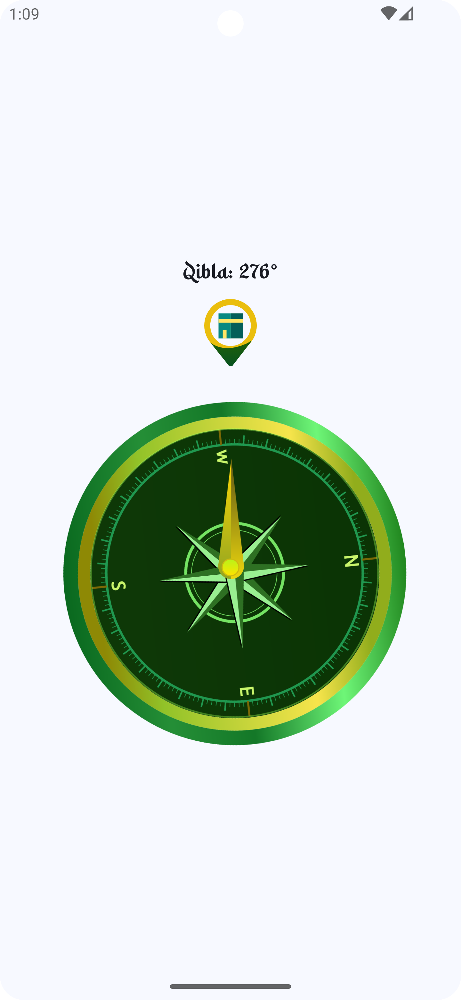

# Qibla Finder

Qibla Finder is a Muslim app designed to help users find the Qibla direction to perform Salat. With an intuitive interface and precise calculations, this app ensures that users can easily determine the correct direction for their prayers.

## Features

- **Accurate Qibla Direction**: Utilizes location and sensor data to provide the precise Qibla direction.
- **User-Friendly Interface**: Simple and clean design for ease of use.
- **Ad-Free Experience**: Focus on your prayers without any distractions.

## Tech Stack

- **Kotlin**: Programming language used for Android development.
- **Jetpack Compose**: Modern toolkit for building native UI.
- **Dagger Hilt**: Dependency injection library for Android.

## Screenshots

<p align="center">
  
  
</p>

## Getting Started

To get a local copy up and running, follow these steps.

### Prerequisites

- Android Studio
- Kotlin

### Installation

1. Clone the repository:
   ```sh
   git clone https://github.com/yourusername/qibla-finder.git

2. Open the project in Android Studio.
3. Build and run the app on your Android device or emulator.

### Usage

1. Open the Qibla Finder app.
2. Allow location and sensor permissions if prompted.
3. The app will display the Qibla direction based on your current location.

## Authors

- [@ihazratummar](https://www.github.com/ihazratummar)

